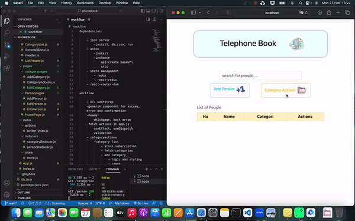

### `npm start Telephone Bok app`

##### 
User can,
    - add, delete, edit person and categories at as his/her wish
    - search for the people in telephone book

##### 

    - json server
        -install, db.json, run
    - axios 
        - used as an instance for typos (create baseURL, api, urls)
    - state management 
        - redux
        - react-redux
    - react-router-dom
        - navigating betwwen pages
    - generik and header components 
        designed as to have different features on different pages.
    - UI, bootstrap and CSS imported for components and pages

##### 
Enjoy screen gif.

